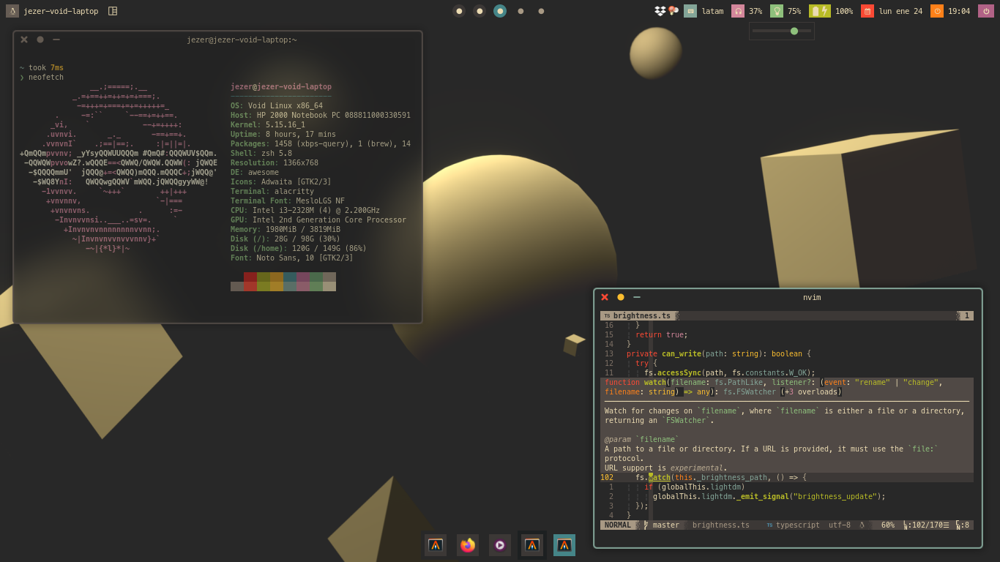
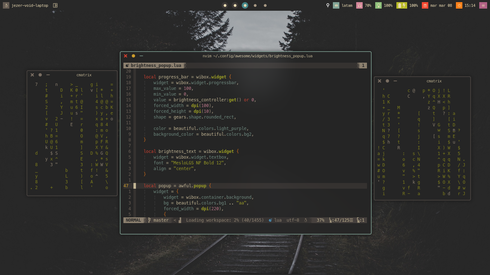
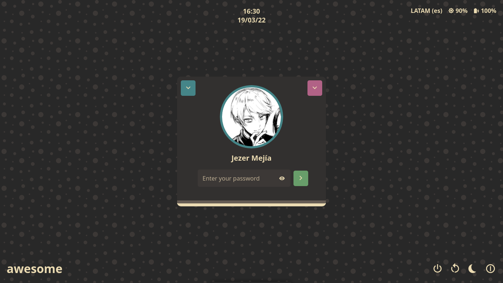

# My dotfiles
These are my dotfiles, in Void Linux, using AwesomeWM and LightDM.








## Dependencies

| Dependency | Required | Description |
|:----------:|:--------:|:-----------:|
| [AwesomeWM][awesomewm]  | :heavy_check_mark: | An awesome window manager |
| [Alacritty][alacritty]  | :heavy_check_mark: | A fast terminal emulator |
| [Neovim][nvim]     | :heavy_check_mark: | Nice editor |
| ACPI and acpi_listen |  | Required for battery management |
| [light-locker][light-locker] with [LightDM][lightdm] | :heavy_check_mark: | Lock screen and login manager |
| [rofi][rofi] | :heavy_check_mark: | Application launcher and other utils |
| [dex][dex] |  | Desktop entry execution |
| pulseaudio and pactl |  | Sound management |
| [playerctl][playerctl] |  | Media player controller |
| [picom-jonaburg][picom-jonaburg] |  | Blurring, shadows, rounded corners, and window animations |
| [xidlehook][xidlehook] |  | Required to lock session on idle |
| [brightnessctl][brightnessctl] |  | Used only with xidlehook to dim and restore screen brightness |
| [zsh][zsh] with [ohmyzsh][ohmyzsh] |  | Z shell and ZSH plugin manager |

## Install

Inside $HOME directory, use:
```sh
git clone --recursive https://github.com/JezerM/dotfiles
cd dotfiles
./install.sh
```

### Brightness setup

TODO

## Keybindings

### Global keys

| Keybinding | Action |
|:----------:|:------:|
| `Mod4 + [1-9]` | Switch to tag [1-9] |
| `Mod4 + s` | Take screenshot with rofi and scrot |
| `Mod4 + Alt + l` | Lock screen with light-locker |
| `Mod4 + Tab` and `Mod4 + Shift + Tab` | Cycle between layouts |
| `Mod4 + j` | Focus next client |
| `Mod4 + k` | Focus previous client |
| `Mod4 + b` | Toggle awesome bar |
| `Mod4 + Return` | Spawn terminal |
| `Mod4 + Ctrl + r` | Reload awesome |
| `Mod4 + Ctrl + q` | Quit awesome |
| `Mod4 + Ctrl + n` | Restore minimized client |
| `Mod4 + r` | Run awesome prompt |
| `Mod4 + p` | Show rofi's app launcher |
| `Mod4 + w` | Show/hide sidebar |
| `Mod4 + v` | Show/hide dock |
| `XF86MonBrightnessUp` | Increase brightness by 10 in 10 steps |
| `XF86MonBrightnessDown` | Decrease brightness by 10 in 10 steps |
| `XF86AudioRaiseVolume` | Increase audio volume by 5 |
| `XF86AudioLowerVolume` | Decrease audio volume by 5 |
| `XF86AudioMute` | Mute audio |

### Client keys

| Keybinding | Action |
|:----------:|:------:|
| `Mod4 + Shift + [1-9]` | Move client to tag [1-9] |
| `Mod4 + f` | Toggle fullscreen |
| `Mod4 + Shift + c` | Close client |
| `Mod4 + Ctrl + space` | Toggle floating |
| `Mod4 + m` | (un)Maximize client |
| `Mod4 + n` | Minimize client |


[acpilight]: https://gitlab.com/wavexx/acpilight
[pulsemixer]: https://github.com/GeorgeFilipkin/pulsemixer
[playerctl]: https://github.com/altdesktop/playerctl
[awesomewm]: https://github.com/awesomeWM/awesome
[alacritty]: https://github.com/alacritty/alacritty
[nvim]: https://github.com/neovim/neovim
[dex]: https://github.com/jceb/dex
[picom-jonaburg]: https://github.com/jonaburg/picom
[rofi]: https://github.com/davatorium/rofi
[light-locker]: https://github.com/the-cavalry/light-locker
[lightdm]: https://github.com/canonical/lightdm
[xidlehook]: https://gitlab.com/jD91mZM2/xidlehook
[brightnessctl]: https://github.com/Hummer12007/brightnessctl
[zsh]: https://www.zsh.org/
[ohmyzsh]: https://ohmyz.sh/
